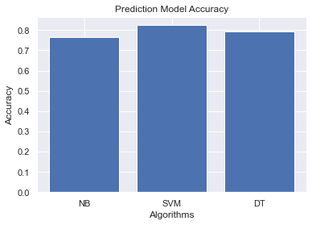

# Diabetes Prediction using Machine Learning

## Overview

This project aims to predict the likelihood of a person having diabetes based on various health indicators and demographic information. Machine learning techniques are employed to analyze a dataset containing relevant features and corresponding diabetes outcomes.

## Dataset

The dataset used for this project is sourced from National Institute of Diabetes and Digestive and Kidney Diseases. It consists of 768 instances and 9 features, including:

- Pregnancies: Number of times pregnant
- Glucose: Plasma glucose concentration a 2 hours in an oral glucose tolerance test
- BloodPressure: Diastolic blood pressure (mm Hg)
- SkinThickness: Triceps skin fold thickness (mm)
- Insulin: 2-Hour serum insulin (mu U/ml)
- BMI: Body mass index (weight in kg/(height in m)^2)
- DiabetesPedigreeFunction: Diabetes pedigree function
- Age: Age (years)
- Outcome: Class variable (0 or 1)

## Methodology

The project follows these main steps:

1. **Data Preprocessing**: Clean the data, handle missing values, and perform feature engineering such as drop null values, drop duplicate values and data imputation.
2. **Exploratory Data Analysis (EDA)**: Analyze the dataset to understand the distribution of features, identify patterns, and visualize relationships between variables.
3. **Feature Selection**: Select the most relevant features for model training to improve prediction performance and reduce complexity with **Pearson’s Correlation Coefficient**.
4. **Model Building**: Utilize various machine learning algorithms such as decision tree, naive bayes and support vector machine to build predictive models.
5. **Model Evaluation**: Evaluate the performance of each model using appropriate metrics such as accuracy, precision, recall, AUC score and F1-score.
6. **Hyperparameter Tuning**: Fine-tune model parameters to optimize performance and generalize better to unseen data.
7. **Prediction**: Deploy the trained model to make predictions on new data and assess its performance in real-world scenarios.

## Results

### Model Performance

- **Naive Bayes**: Achieved an accuracy of 0.77 and a precision of 0.64.
- **Decision Tree**: Demonstrated moderate performance with an accuracy of 0.79 and a precision of 0.72.
- **Support Vector Machine (SVM)**: Outperformed other models with an accuracy of 0.82 and a precision of 0.78.

### Insights

- There is a strong correlation between glucose levels and diabetes risk, highlighting the importance of blood sugar management.
- BMI emerged as a significant predictor, indicating the influence of weight management on diabetes prevention.
- Age showed a moderate impact, suggesting that older individuals may have a higher likelihood of developing diabetes.

### Visualizations

*Figure 1: Accuracy Score.*

## Development

1. **Installation**: Clone the repository and install necessary dependencies using `pip install -r requirements.txt`.
2. **Data Preparation**: Download the dataset and place it in the designated directory.
3. **Execution**: Run the Jupyter Notebook to execute the analysis and generate predictions.
4. **Interpretation**: Review the generated outputs, visualizations, and model performance metrics to interpret the results.

## Future Work

- Incorporate additional features or datasets to enhance prediction accuracy.
- Experiment with advanced machine learning techniques or ensemble methods.
- Explore techniques for model explainability and interpretability to gain insights into the factors influencing diabetes prediction.

